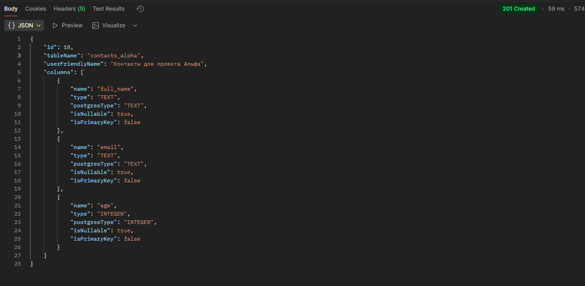
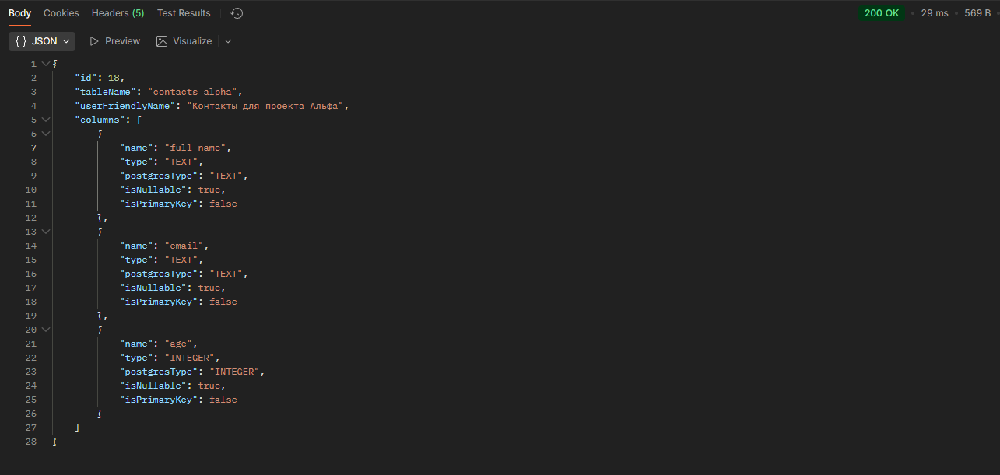
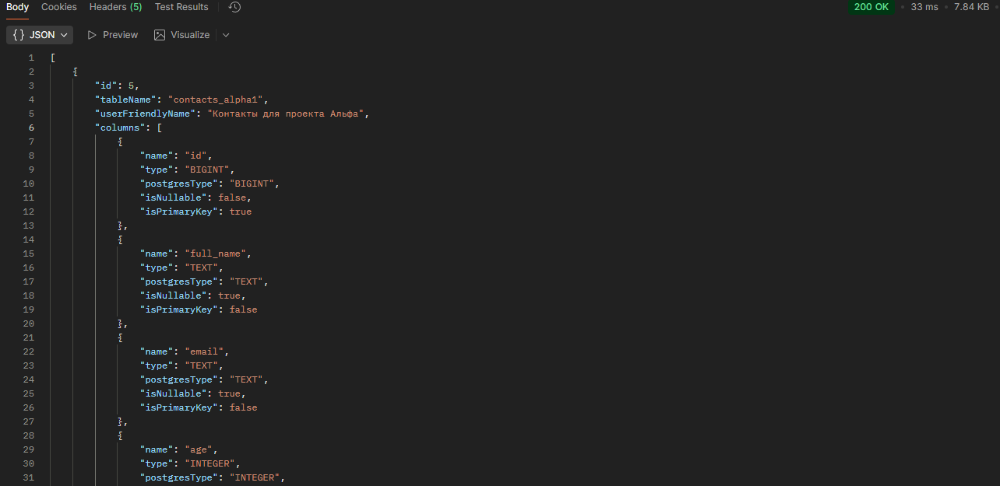
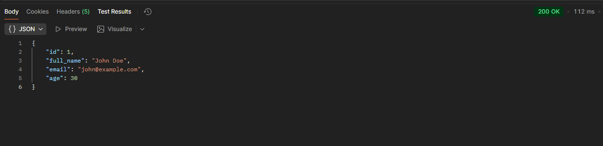
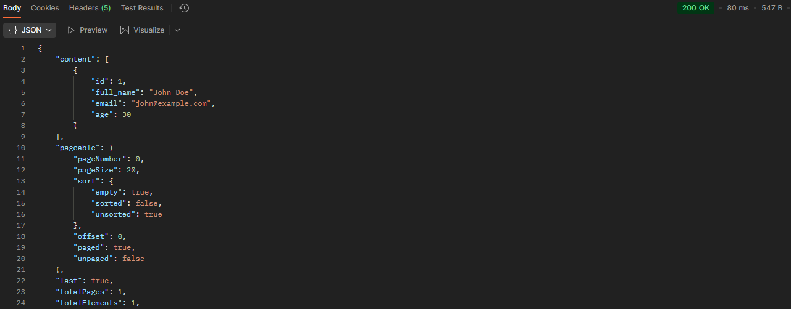
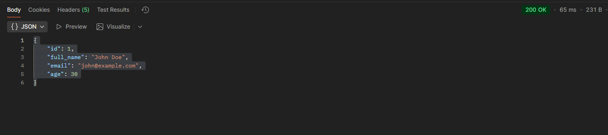

# Dynamic Tables

Небольшой сервис на Spring Boot для динамического описания таблиц ("схем") и работы с их данными. Схемы хранятся в служебных таблицах PostgreSQL, а под каждую созданную схему сервис создаёт реальную таблицу и позволяет выполнять CRUD-операции над её строками через REST API.


## Требования и окружение
- Java 17+
- Maven 3.9+
- PostgreSQL 16 (можно поднять через Docker)
- Порт приложения: 8080 (по умолчанию)

База данных по умолчанию:
- host: localhost
- port: 5433
- db: dynamic_tables_db
- user: user
- password: 1

Эти значения заданы в `src/main/resources/application.yml` и в `docker-compose.yaml`.


## Быстрый старт (PostgreSQL в Docker)
1) Поднять PostgreSQL:
```
# В корне проекта
docker compose up -d
```

2) Собрать и запустить приложение:
```
# Сборка
mvn clean package

# Запуск (вариант 1)
mvn spring-boot:run

# Запуск (вариант 2)
java -jar target/dynamic-tables-0.0.1-SNAPSHOT.jar
```

Liquibase применит миграции автоматически при старте (файлы в `src/main/resources/db/changelog/sql/`).


## Модель данных (служебные таблицы)
- `app_dynamic_table_definitions` — хранит метаданные таблиц (schema): id, системное имя таблицы, человеко-понятное имя, время создания.
- `app_dynamic_column_definitions` — хранит метаданные колонок каждой схемы: имя, тип (логический), сопоставленный тип PostgreSQL, nullable, и т.д.

При создании новой схемы сервис создаёт физическую таблицу `<table_name>` c первичным ключом `id BIGSERIAL`.


## Правила именования и типы
- Имя таблицы: только строчные латинские буквы, цифры и подчёркивание. Не должно начинаться с `pg_` или `app_`.
  - Регулярное выражение: `^(?!pg_)(?!app_)[a-z0-9_]+$`
  - Длина: 3..63 символа
- Имя колонки: только строчные латинские буквы, цифры и подчёркивание. Не должно начинаться с `pg_`, `app_`, `user`.
  - Регулярное выражение: `^(?!pg_)(?!app_)(?!user)[a-z0-9_]+$`
  - Длина: до 255 символов
- Допустимые логические типы (пара `type` → PostgreSQL):
  - `TEXT` → `TEXT`
  - `INTEGER` → `INTEGER`
  - `BIGINT` → `BIGINT`
  - `DECIMAL` → `NUMERIC(19,4)`
  - `BOOLEAN` → `BOOLEAN`
  - `DATE` → `TEXT` (упрощённо хранится как текст)
  - `TIMESTAMP` → `TIMESTAMP WITHOUT TIME ZONE`


## Валидация входных данных
- `tableName`: обязателен, см. правила выше
- `userFriendlyName`: максимум 255 символов
- `columns`: не пустой список
- `ColumnRequest.name`: обязателен, см. правила выше
- `ColumnRequest.type`: обязателен, максимум 50 символов
- `ColumnRequest.isNullable`: если false, колонка будет создана как NOT NULL

Ошибки валидации возвращаются с HTTP 400.


## REST API
Базовый префикс: `/api/v1/dynamic-tables`

### 1) Создать схему
POST `/schemas`

Пример запроса:
```
curl -X POST "http://localhost:8080/api/v1/dynamic-tables/schemas" \
  -H "Content-Type: application/json" \
  -d '{
    "tableName": "contacts_alpha",
    "userFriendlyName": "Контакты для проекта Альфа",
    "columns": [
      { "name": "full_name", "type": "TEXT", "isNullable": false },
      { "name": "email", "type": "TEXT", "isNullable": true },
      { "name": "age", "type": "INTEGER", "isNullable": true }
    ]
  }'
```
Успешный ответ 201 (пример структуры):


### 2) Получить схему по имени
GET `/schemas/{tableName}`
```
curl "http://localhost:8080/api/v1/dynamic-tables/schemas/contacts_alpha"
```

Успешный ответ 200 (пример структуры):


### 3) Список всех схем
GET `/schemas`
```
curl "http://localhost:8080/api/v1/dynamic-tables/schemas"
```
Успешный ответ 200 (пример структуры):

### 4) Вставить данные в таблицу
POST `/data/{tableName}`
```
curl -X POST "http://localhost:8080/api/v1/dynamic-tables/data/contacts_alpha" \
  -H "Content-Type: application/json" \
  -d '{
    "full_name": "John Doe",
    "email": "john@example.com",
    "age": 30
  }'
```
Ответ 201 (пример):


### 5) Пагинированный список данных таблицы
GET `/data/{tableName}?page=0&size=20`
```
curl "http://localhost:8080/api/v1/dynamic-tables/data/contacts_alpha?page=0&size=20"
```
Ответ — стандартный объект Page Spring: поля `content`, `totalElements`, `totalPages`, `size`, `number`, `first`, `last`, `sort`, `pageable`, и т.д.


### 6) Получить запись по id
GET `/data/{tableName}/{id}`
```
curl "http://localhost:8080/api/v1/dynamic-tables/data/contacts_alpha/1"
```

Ответ 200 — объект строки с полями, соответствующими колонкам таблицы.


### 7) Обновить запись по id
PUT `/data/{tableName}/{id}`
```
curl -X PUT "http://localhost:8080/api/v1/dynamic-tables/data/contacts_alpha/1" \
  -H "Content-Type: application/json" \
  -d '{
    "email": "john.doe@example.com",
    "age": 31,
    "full_name": "John Not Doe"
  }'
```
Ответ 200 — объект строки после обновления.


### 8) Удалить запись по id
DELETE `/data/{tableName}/{id}`
```
curl -X DELETE "http://localhost:8080/api/v1/dynamic-tables/data/contacts_alpha/1" -i
```
Ответ 204 No Content.


## Типовые ошибки и подсказки
- Liquibase: путь в `db.changelog-master.yaml` использует `includeAll: path: db/changelog/sql`. В эту директорию должны попадать SQL-файлы (например, `schema.sql`). Не указывайте путь к конкретному файлу в `includeAll`.
- 400 Validation failed: проверьте длину и формат `tableName`, длину `userFriendlyName` (≤ 255), непустой список `columns`.
- Конфликт имени таблицы: если таблица уже существует в метаданных, вернётся 409 (Conflict).
- Типы данных: используйте один из поддерживаемых логических типов из раздела выше.


## Принятые решения и допущения
- Создание схемы всегда добавляет колонку `id BIGSERIAL PRIMARY KEY`.
- Логические типы маппятся в PostgreSQL через простой `TypeMapper` (см. `src/main/java/.../util/TypeMapper.java`). Значение `DATE` упрощённо хранится в `TEXT`.
- Для простоты имена таблиц/колонок не экранируются кавычками; используйте только поддерживаемый формат имён (см. правила), чтобы избежать конфликтов с зарезервированными словами.
- Возврат данных реализован через Jackson `ObjectNode`/`JsonNode`, чтобы содержимое строк было гибким.
- Liquibase создаёт только служебные таблицы. Пользовательские таблицы создаются на лету при вызове API создания схемы.


## Локальная разработка
- Пересобрать быстро: `mvn -q -DskipTests spring-boot:run`
- Логи SQL можете включить через `spring.jpa/show-sql` (не используется JPA) или логгер JDBC (вне рамок текущего проекта).
- Порт/учётные данные БД меняются в `application.yml`.
